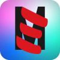
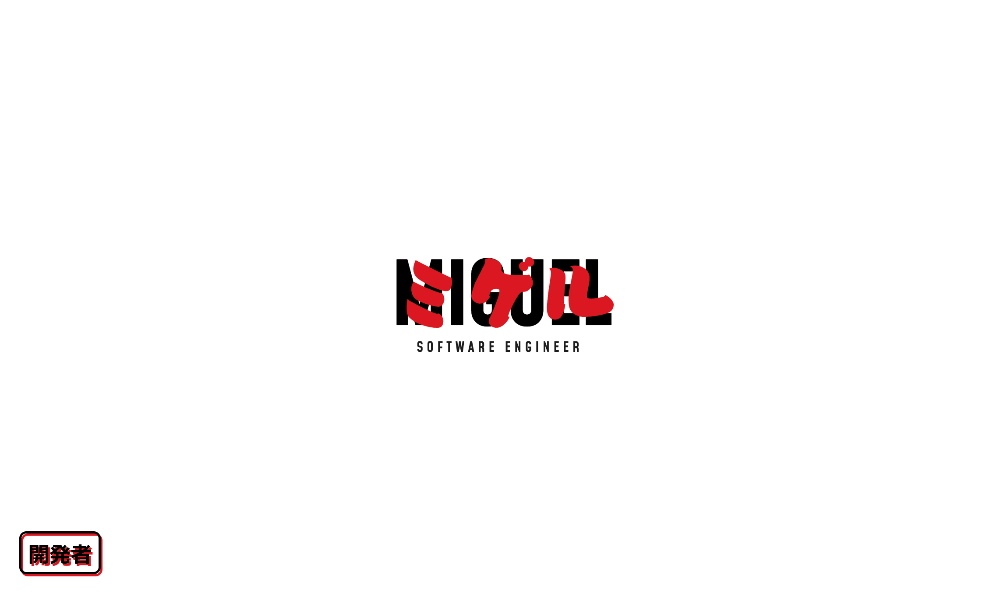
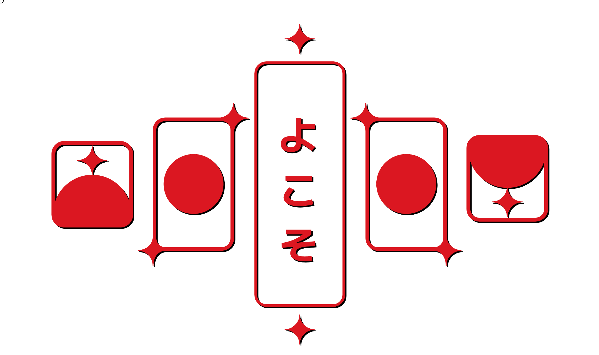
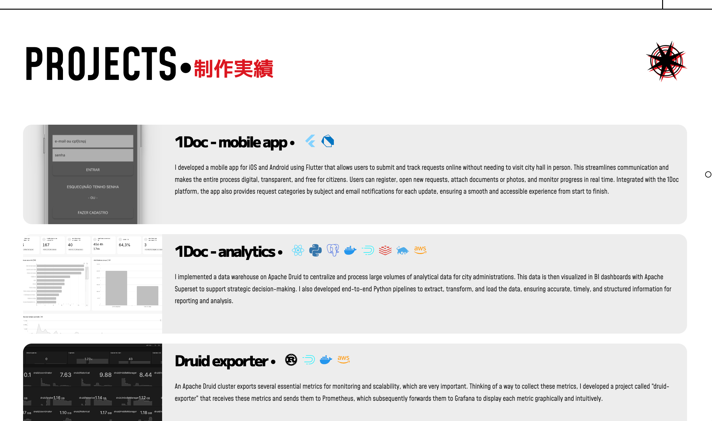
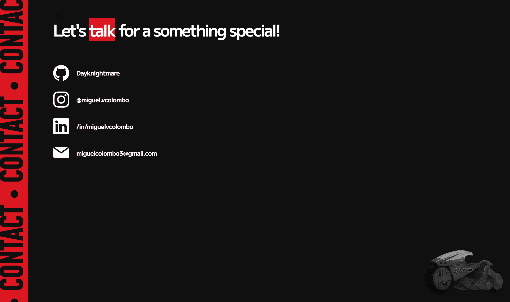

<p align="center">
  
</p>

<samp><h6 align="center">#devlife, #project, #portfolio</h6></samp>
<samp><h1 align="center">Portfolio</h1></samp>

<p align="center">
  
  
</p>


This portfolio project highlights my work as a backend developer, featuring examples of clean architecture, API development, authentication flows, and data processing pipelines. Built with modern technologies to demonstrate real-world backend design patterns and scalability practices.

<br />

## Live portfolio

>
> ### https://miguelcolombo.dev
>
<br>

## Photos

<kbd></kbd>
<br />
<br />
<kbd></kdb>
<br />
<br />
<kbd></kdb>
<br />
<br />
<kbd></kdb>
<br />

## Run

Clone repository

```
git clone https://github.com/dayknightmare/portfolio.git

OR

git clone git@github.com:dayknightmare/portfolio.git
```
Install dependencies

```
npm i
```
Run dev mode

```
npm run dev
```

Open [Localhost:3000](http://localhost:3000) on your browser

<br>

## Contribute

Want to be part of this project?

Whether it’s improving documentation, fixing bugs, or adding new features — your help is always welcome.

Just fork the repo, make your changes, and open a pull request. Let’s build something great together!
