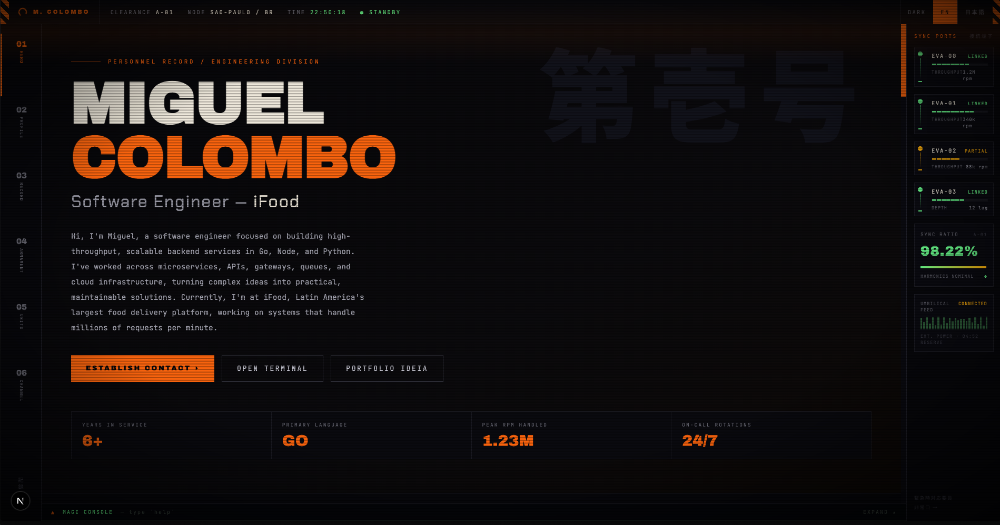

<p align="center">
  
</p>

<samp><h6 align="center">#devlife, #project, #portfolio</h6></samp>
<samp><h1 align="center">Portfolio</h1></samp>

<p align="center">
  
  
  
  
  
  
</p>

My personal portfolio, built as an EVA/NERV-style **operator console** instead of a conventional
one-page site. It opens with a boot sequence, frames the content in an instrumented chrome
(top status bar, numbered section rail, right-side telemetry) and ships an interactive MAGI
terminal you can actually type into.

<p align="center">
  
</p>

## Live portfolio

>
> ### https://miguelcolombo.dev
>

## Highlights

- **Boot sequence** — fake MAGI handshake log that plays before the site reveals itself.
- **Six sections** — hero, profile, experience record, stack, projects and contact, each wired to
  the numbered left rail and scroll-driven animation (the projects section drives a blast-door
  reveal from scroll progress).
- **MAGI terminal** — in-page console with `help`, `whoami`, `status`, `hire`, `goto <section>`,
  `lang <en|ja>`, `theme <dark|light>`, `sudo` and `clear`.
- **Bilingual** — every string exists in English and Japanese; language is switchable from the top
  menu or the terminal and persisted in `localStorage`.
- **Theming** — dark and light palettes, fully token-based, also persisted and read synchronously
  on first render so there is no flash of the wrong theme.
- **CRT chrome** — scanlines, vignette and a sweeping highlight as composable effect layers.
- **Design case study** — `/ideia` documents how the interface was designed: references, palette,
  typography, frame anatomy, effects, components and history. It is a prototype/reference page,
  not part of the live site.

## Stack

| Concern    | Choice                                        |
| ---------- | --------------------------------------------- |
| Framework  | Next.js 16 (App Router)                       |
| UI         | React 19                                      |
| Styling    | Emotion (`styled`) with SSR cache provider    |
| Language   | TypeScript                                    |
| Lint/format| Biome                                         |
| Runtime    | Node 24 (`.tool-versions`)                    |

## Run

Clone repository

```
git clone https://github.com/dayknightmare/portfolio.git

OR

git clone git@github.com:dayknightmare/portfolio.git
```
Install dependencies

```
npm i
```
Run dev mode

```
npm run dev
```

Open [Localhost:3001](http://localhost:3001) on your browser

### Scripts

| Script             | Does                             |
| ------------------ | -------------------------------- |
| `npm run dev`      | Dev server                       |
| `npm run build`    | Production build                 |
| `npm start`        | Serve the production build       |
| `npm run lint`     | Biome check                      |
| `npm run lint:fix` | Biome check with autofix         |

Type-check with `npx tsc --noEmit`.

## Project structure

```
src/
  app/
    layout.tsx               # root <html>, fonts, metadata (server component)
    (pages)/layout.tsx       # Emotion cache + theme provider + global styles (client)
    (pages)/globals.ts       # global styles and @keyframes (nvBlink, nvSweep, ...)
    (pages)/page.tsx         # the site -> <Nerv />
    (pages)/ideia/page.tsx   # design case study / prototype
  components/
    nerv/                    # the console: Nerv.tsx + menus, sections, terminal, effects
    ideia/                   # case-study page: sections, specimens, small UI primitives
    bootloader/              # boot log screen
    copy.ts                  # all user-facing text, keyed by Lang ('en' | 'ja')
    themes/                  # PortfolioTheme type + dark (theme.ts) and light (light.ts)
  providers/                 # Emotion SSR cache, theme provider and theme context
```

`src/components/nerv/Nerv.tsx` is the composition root: it owns language, the 1s tick, scroll
progress and the section refs, and hands them to the menus, sections and terminal.

## Conventions

- No inline `style={{...}}` for static styling. Every component folder has a `style.ts` with
  Emotion `styled` components, imported as `import * as S from './style'` and used as `<S.Name />`.
  Values that change continuously (per scroll/tick widths, transforms) do stay in `style={{}}` so
  Emotion does not generate a class per value.
- Colors always come from the theme (`${(p) => p.theme.colors...}`), never hard-coded hex. A new
  color means a new token in `PortfolioTheme` **and** in both `theme.ts` and `light.ts`.
- Discrete variants are typed props on the styled component, named to avoid valid HTML attributes
  (`tone`, `portColor`, `expanded` — not `color`, `open`).
- Shared animations are `@keyframes` in `(pages)/globals.ts`, referenced by name.
- New strings go into `COPY.en` **and** `COPY.ja` plus the `Copy` interface.

Full version of these rules lives in [`AGENTS.md`](./AGENTS.md).

## Adding a terminal command

Commands are small classes implementing `Command<Args>` (`handler` + `help`) under
`src/components/nerv/terminal/commands/`. Write the class, then register it in the `commands`
map in `commander.tsx` — `help` and dispatch pick it up automatically.

## Contribute

Want to be part of this project?

Whether it's improving documentation, fixing bugs, or adding new features — your help is always
welcome.

Just fork the repo, make your changes, and open a pull request. Let's build something great
together!
